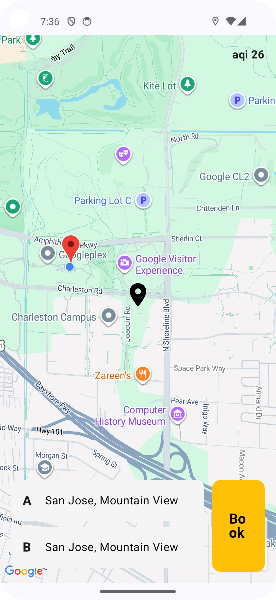
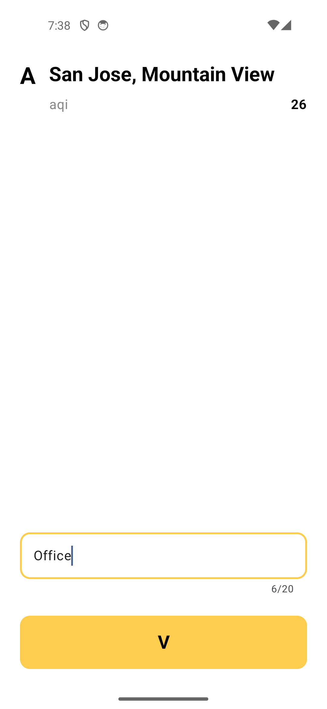
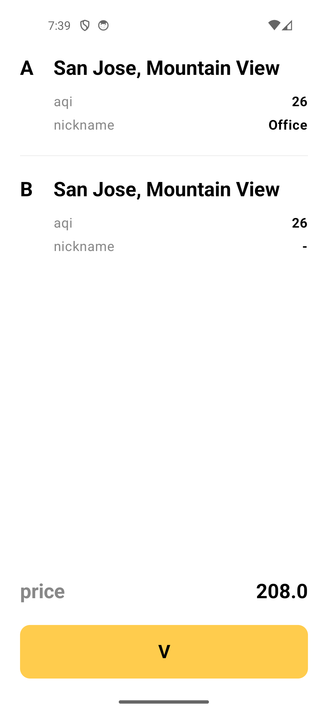

# AeroBook ✈️
**AeroBook** is a modern Android application designed for eco-conscious travelers. It allows users to plan trips between two points while monitoring real-time **Air Quality Index (AQI)** data. Built with **Clean Architecture** principles, the app demonstrates advanced Android capabilities like reactive UI, dependency injection, and sophisticated network mocking.

---

## 📱 Features
* **Interactive Map Selection:** Choose pickup (A) and drop-off (B) locations directly from a map.
* **Real-time AQI Insights:** Fetch environmental data for every selected point to make informed travel choices.
* **Location Nicknaming:** Personalize your frequent spots (e.g., "Home," "Office") with a 20-character limit.
* **Persistent Booking History:** A global history tracker that calculates total trips and total expenditure.
* **Smart State Management:** Seamlessly handles location permissions and camera movements.

---

## 🛠 Tech Stack
* **Language:** Kotlin
* **UI Framework:** Jetpack Compose (100% Declarative UI)
* **Architecture:** Clean Architecture (Data, Domain, Presentation layers)
* **Asynchronous Logic:** Kotlin Coroutines & Flow
* **Dependency Injection:** Hilt (Dagger)
* **Networking:** Retrofit & OkHttp
* **Mocking:** Custom OkHttp Interceptors for stateful "Global" API simulation.
* **Navigation:** Jetpack Compose Navigation with Type-safe argument passing.

---

## 🏗 Architecture Overview
The project follows **Clean Architecture** to ensure the code is testable, scalable, and independent of external libraries.


* **Presentation Layer:** Uses **MVI/MVVM** pattern with `StateFlow`. UI components are built using atomic design principles in Compose.
* **Domain Layer:** Contains purely Kotlin-based Business Logic (Use Cases and Models), completely independent of Android frameworks.
* **Data Layer:** Implements Repositories, API interfaces, and Data Sources (Mocks/Cache).

---

## 🚀 How to Run
1.  **Clone the repository:**
    ```bash
    git clone https://github.com/YourUsername/AeroBook-Android.git
    ```
2.  **Add API Keys:**
    Open `local.properties` and add your keys (if any) or ensure the `MockInterceptor` is enabled in the `NetworkModule`.
3.  **Build & Run:**
    Open the project in **Android Studio Ladybug** or higher and run the `app` module on an emulator or physical device.

---

## 📸 Screenshots
| Map Selection | Location Nickname | Booking Summary | History |
| :---: | :---: | :---: | :---: |
|  |  |  |  |

---

## 🛡️ Key Implementation Highlights
* **Global History Logic:** Instead of static JSON, I implemented a **Stateful Interceptor**. When a user "books" a ride, the Interceptor updates a global list in memory, allowing the History screen to update dynamically as if connected to a real backend.
* **SOLID Compliance:** Refactored unified repositories into specialized `LocationRepository` and `BookingRepository` to ensure Single Responsibility.
* **Safe Navigation:** Implemented `Uri.encode` and `Gson` serialization to pass complex objects between Compose screens safely.

---

### ✍️ Author
**Shakti** – Senior Software Engineer | Mobile Developer
* [LinkedIn](http://www.linkedin.com/in/shakti-subhra-priyadarsini-swain)

---
